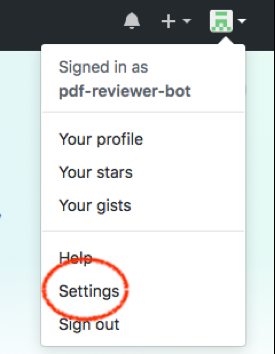
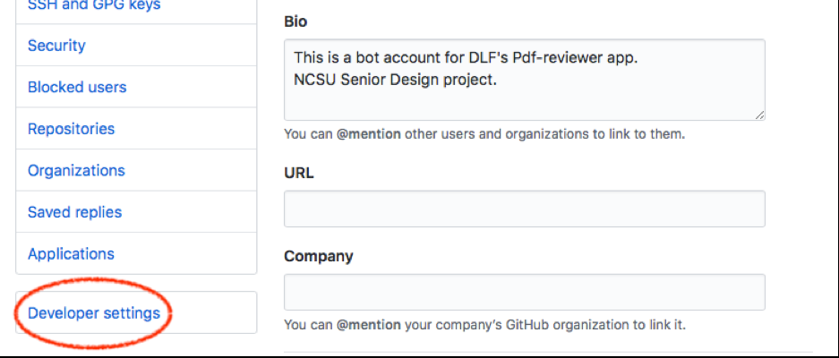
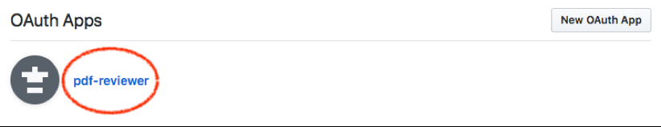
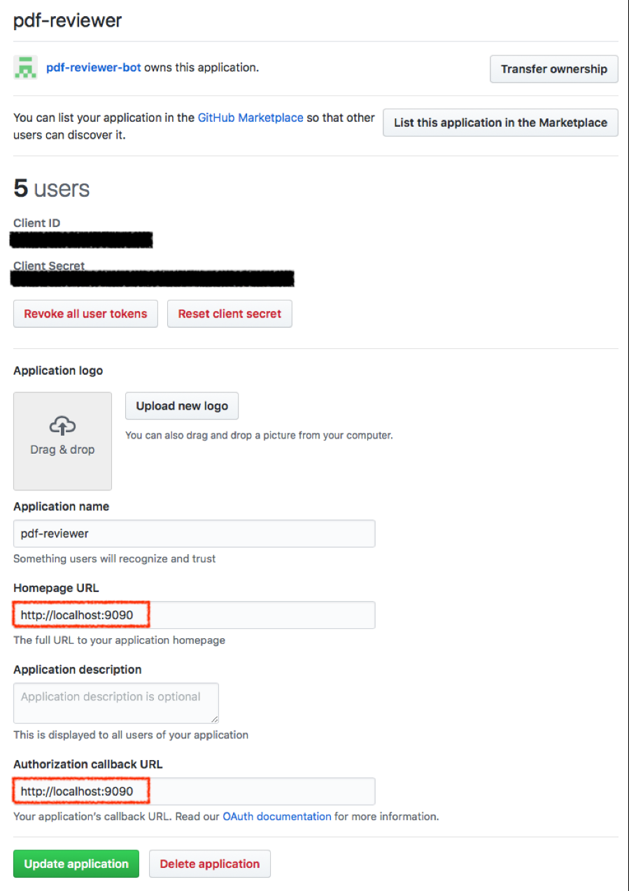

# PDF Reviewer Tool Installation Guide

In this guide we explain the steps to deploy the PDF Reviewer Tool. We automated most of the configuration of the application using Ansible scripts. Our Ansible scripts are available in our repository, in the ansible directory.

Before starting the deployment process, please make sure the requirements below are met:
Availability of an Ubuntu linux server (or VM) with network access. Ports 9090 (for PDF Reviewer Tool) and 22 (for SSH) should be accessible.

* Authorized SSH key or username/password for the server
* An Ansible control machine (Linux or Mac OS), + sshpass utility

Clone PDF Reviewer Tool (master branch) on the Ansible control machine and follow the steps below to deploy the tool on an Ubuntu server that you already have SSH access to:

1. Copy the example inventory file `./ansible/inventory.example` to `./ansible/inventory` and update it with the IP address, username and path to private SSH key of your Ubuntu server:

    ``` bash
    {IP}  ansible_user={USERNAME} ansible_ssh_private_key_file={PATH TO KEY} ansible_python_interpreter=/usr/bin/python3
    ```

    if you need to use username and password to ssh to your server (instead of SSH key), use this inventory template instead: 

    ``` bash
    {IP} ansible_user={USERNAME} ansible_python_interpreter=/usr/bin/python3
    ```

2. After updating the inventory, run the command below to run the Ansible playbook (`./ansible/deployment.yml`) on the Ubuntu server:

    ``` bash
    $ ansible-playbook --ask-become-pass --ask-pass --vault-id @prompt -i inventory deployment.yml
    ```

    This will prompt for ssh password, sudo password and Ansible vault password (use: pdf-reviewer-tool) which is automatically used to access credentials that are stored in Ansible vault.

3. To start the server, SSH to the server and go to ~/pdf-review-tool directory:

    ``` bash
    $ nohup mvn tomcat7:run >> stdout.out 2>&1 &
    ```

4. After the ansible script completes, open the URL below in your browser to see the login page of PDF Reviewer Tool: `http://{IP}:9090/`

5. PDF Reviewer Tool uses GitHub OAuth, and this requires a GitHub OAuth app. To update the configuration of this OAuth app follow the steps below:

    Go to GitHub settings in "pdf-reviewer-bot" account

    

    From settings, go to Developer Settings section

    

    Select pdf-reviewer from the list of OAuth Apps

    

    Then you will see pdf-reviewer app configuration. For the deployed app to work, you will need to update "localhost" URLs below to be the IP address of you server that you used for deployment.

    